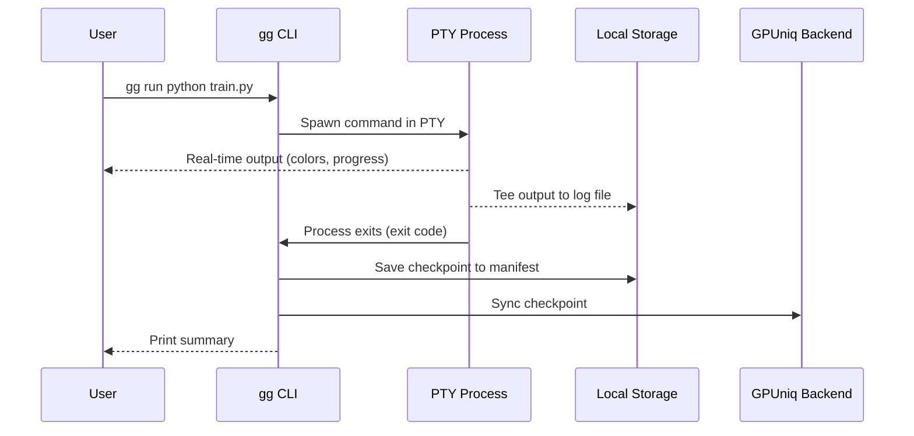

## Overview

`gg` is a command-line tool that runs inside your rented GPU instance. It wraps any shell command with automatic checkpointing — every command you run is saved with its full output, exit code, and timing. If your instance restarts, `gg replay` re-runs unfinished commands automatically.

**Key features:**
- Checkpoint every command with full log capture
- Replay unfinished commands after instance restart
- Sync checkpoints to the GPUniq backend
- Browse and search command history

## Installation

`gg` is included in the GPUniq Python package:

```bash
pip install GPUniq
```

This installs both the Python SDK and the `gg` CLI. Requires Python 3.8+.

## Quick Start

```bash
# 1. Initialize with your API token (shown in dashboard after rental)
gg init <your-gg-token>

# 2. Run any command — it gets checkpointed automatically
gg run python train.py --epochs 50

# 3. Check your command history
gg list

# 4. View logs from a checkpoint
gg logs abc12

# 5. After instance restart — replay unfinished commands
gg replay
```

## Commands

### `gg init`

Initialize `gg` on your instance. Run this once after connecting.

```bash
gg init <token>
```

- **token** — your GG token, shown in the dashboard after renting an instance
- Verifies the token with the GPUniq backend
- Creates the `.gg` directory at `/workspace/volume/.gg`
- Stores config, checkpoint manifest, and logs

<Callout kind="info">
  You only need to run `gg init` once per instance. The config persists across sessions.
</Callout>

### `gg run`

Execute a command with automatic checkpointing.

```bash
gg run <command>
```

**Examples:**
```bash
gg run python train.py --epochs 100 --lr 0.001
gg run bash setup.sh
gg run nvidia-smi
```

**Shorthand** — if the first argument is not a known subcommand (`init`, `list`, `logs`, `replay`, `status`), `gg` treats the entire input as a command:

```bash
# These are equivalent:
gg run python train.py
gg python train.py
```

**What happens when you run a command:**
1. Command starts in a PTY with full terminal support (colors, progress bars)
2. Output is teed to both your terminal and a log file
3. On completion, a checkpoint is saved locally with:
   - Unique checkpoint ID
   - Command text, exit code, status
   - Start/end timestamps, duration
   - Working directory, log file path
4. Checkpoint is synced to the GPUniq backend
5. Summary is printed with checkpoint ID

**Output:**
```
[gg] command      : python train.py --epochs 100
[gg] exit_code    : 0
[gg] status       : completed
[gg] duration     : 3421s
[gg] checkpoint   : a1b2c3d4
```

<Callout kind="warning">
  Log files are capped at 100 MB per command. Output beyond that limit is truncated.
</Callout>

### `gg list`

Show all saved checkpoints.

```bash
gg list
```

Displays a formatted table with:
- Checkpoint ID (short prefix)
- Command
- Status (`completed`, `failed`, `killed`)
- Exit code
- Duration
- Sync status

### `gg logs`

View the full output log of a checkpoint.

```bash
gg logs <checkpoint_id> [--tail N]
```

- **checkpoint_id** — full ID or short prefix (first few characters)
- **--tail N** — show only the last N lines (default: full log)

**Examples:**
```bash
# Full log
gg logs a1b2c3

# Last 50 lines
gg logs a1b2 --tail 50
```

### `gg replay`

Re-run all commands that were interrupted (status: `running` or `killed`).

```bash
gg replay
```

Use this after an instance restart to resume training or setup scripts. Each replayed command creates a new checkpoint.

### `gg status`

Show current `gg` configuration and statistics.

```bash
gg status
```

Displays:
- Instance name and task ID
- API endpoint
- Number of saved checkpoints
- Total log size on disk

## How It Works



## Storage Layout

All `gg` data is stored under `/workspace/volume/.gg/`:

```
/workspace/volume/.gg/
  config.json        # Token, API URL, instance info
  checkpoints.json   # Checkpoint manifest (all runs)
  logs/
    <checkpoint_id>.log   # Output log per command
```

Since `/workspace/volume/` is on a persistent volume, your checkpoints survive instance restarts.

## Typical Workflow

```bash
# Connect to your instance
ssh root@<host> -p <port>

# First time: initialize gg
gg init eyJhbGciOi...

# Run your setup
gg run apt-get update && apt-get install -y vim htop
gg run pip install torch transformers wandb

# Start training
gg run python train.py --config config.yaml

# Check history
gg list

# If instance restarts, reconnect and:
gg replay
```

## Notes

- `gg` uses a PTY, so commands behave exactly as in a normal terminal — interactive prompts, colors, and progress bars all work
- SIGINT (Ctrl+C) and SIGTERM are forwarded to the running process
- Checkpoint sync to the backend is fire-and-forget — if the network is unavailable, checkpoints are still saved locally
- The `gg` token is separate from your API key. It is instance-specific and shown in the dashboard after you rent a GPU
