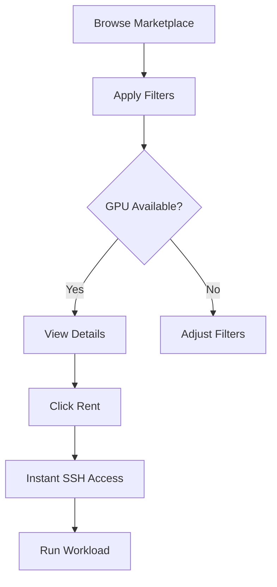
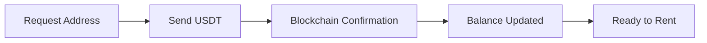

## Overview

GPUniq is a GPU rental marketplace connecting users who need compute power with GPU owners worldwide. Access high-performance hardware at competitive prices, with up to 70% cost savings compared to traditional cloud providers. Key features include a real-time marketplace, AI-powered recommendations, flexible pricing, and crypto payments.

<Callout kind="info">
  GPUniq operates as a peer-to-peer marketplace - you rent directly from GPU owners, ensuring competitive pricing and diverse hardware options.
</Callout>

## Available GPU Types

GPUniq marketplace offers a wide range of GPUs. Availability varies based on what providers have connected.

| GPU Model | VRAM | Typical Use Cases |
|-----------|------|-------------------|
| NVIDIA RTX 4090 | 24GB | Training, inference, rendering |
| NVIDIA RTX 3090 | 24GB | ML workloads, gaming |
| NVIDIA A100 | 40/80GB | Large model training, HPC |
| NVIDIA H100 | 80GB | Frontier AI, research |
| NVIDIA A6000 | 48GB | Professional rendering, ML |
| NVIDIA L40S | 48GB | Inference, video processing |

<Columns cols={2}>
  <Card title="High VRAM Options" icon="database" href="#available-gpu-types">
    Select A100 or H100 for memory-intensive tasks like training LLMs.
  </Card>
  <Card title="Cost-Effective Choices" icon="dollar-sign" href="#available-gpu-types">
    Use RTX 4090/3090 for excellent price/performance ratio.
  </Card>
</Columns>

## Real-Time Marketplace

Browse available GPUs instantly with powerful filtering options.



### Marketplace Filters

<ParamField query="gpu_model" param-type="string">
  Filter by specific GPU model (e.g., "RTX 4090", "A100").
</ParamField>

<ParamField query="min_vram_gb" param-type="integer">
  Minimum VRAM in gigabytes.
</ParamField>

<ParamField query="max_price_per_hour" param-type="number">
  Maximum hourly price in USD.
</ParamField>

<ParamField query="location" param-type="string">
  Geographic location filter.
</ParamField>

<ParamField query="verified" param-type="boolean">
  Show only verified providers with proven reliability.
</ParamField>

## AI-Powered Recommendations

Not sure which GPU to rent? Our AI assistant helps you find the perfect match.

<Tabs>
  <Tab title="Ask AI" icon="cpu">
    Send a natural language query to get personalized GPU recommendations:

```bash
curl -X POST https://api.gpuniq.com/v1/ai/recommendation \
  -H "Content-Type: application/json" \
  -d '{
    "query": "I need to fine-tune Llama 3 70B with LoRA, what GPU should I rent?"
  }'
```
  </Tab>
  <Tab title="Response" icon="message-square">
```json
{
  "data": {
    "recommendation": "For fine-tuning Llama 3 70B with LoRA, I recommend...",
    "suggested_gpus": [
      {"model": "A100 80GB", "reason": "Optimal for 70B models"},
      {"model": "H100", "reason": "Fastest training speed"}
    ]
  }
}
```
  </Tab>
</Tabs>

## Flexible Pricing

GPUniq offers multiple pricing options to match your needs.

| Pricing Type | Description | Best For |
|-------------|-------------|----------|
| Per Minute | Pay only for exact usage | Short experiments |
| Per Hour | Standard hourly billing | Regular workloads |
| Per Day | Discounted daily rate | Extended training |
| Per Week | Weekly discount | Production jobs |
| Per Month | Best monthly rate | Continuous usage |

<Callout kind="tip">
  Longer commitments typically offer 20-40% savings compared to per-minute pricing.
</Callout>

## Payment Methods

GPUniq supports both crypto and traditional payments.

<Columns cols={2}>
  <Card title="USDT (TRC20)" icon="bitcoin">
    Deposit and withdraw using Tether on Tron network. Low fees, fast confirmation.
  </Card>
  <Card title="YooKassa" icon="credit-card">
    Russian users can pay in rubles via bank cards and other local methods.
  </Card>
</Columns>

### Crypto Deposit Flow



## Instance Management

Control your GPU rentals efficiently.

<Columns cols={3}>
  <Card title="Start" icon="play" href="/managing-instances">
    Launch a new rental instantly.
  </Card>
  <Card title="Stop" icon="pause" href="/managing-instances">
    Pause rental and stop billing.
  </Card>
  <Card title="Delete" icon="trash-2" href="/managing-instances">
    Terminate rental completely.
  </Card>
</Columns>

### API Instance Control

<CodeGroup tabs="Start,Stop,Delete">
```bash
# Start instance
curl -X POST https://api.gpuniq.com/v1/instances/{task_id}/start \
  -H "Authorization: Bearer YOUR_API_KEY"
```

```bash
# Stop instance
curl -X POST https://api.gpuniq.com/v1/instances/{task_id}/stop \
  -H "Authorization: Bearer YOUR_API_KEY"
```

```bash
# Delete instance
curl -X DELETE https://api.gpuniq.com/v1/instances/{task_id} \
  -H "Authorization: Bearer YOUR_API_KEY"
```
</CodeGroup>

## Become a Provider

Own GPUs? Connect them to GPUniq and earn passive income.

<Steps>
  <Step title="Install Agent" icon="download">
    Download and run the GPUniq agent on your GPU machine.
  </Step>
  <Step title="Register" icon="settings">
    Set your hourly price and availability parameters.
  </Step>
  <Step title="Go Live" icon="zap">
    Your GPU appears in the marketplace for users to rent.
  </Step>
  <Step title="Earn" icon="dollar-sign">
    Receive payments directly to your account balance.
  </Step>
</Steps>

<Expandable title="Provider Benefits" default-open="false">
  - Set your own prices (per hour, day, week, month)
  - Control maximum rental duration
  - Monitor active rentals in real-time
  - Force-stop or delete problematic rentals
  - Withdraw earnings in USDT
</Expandable>
