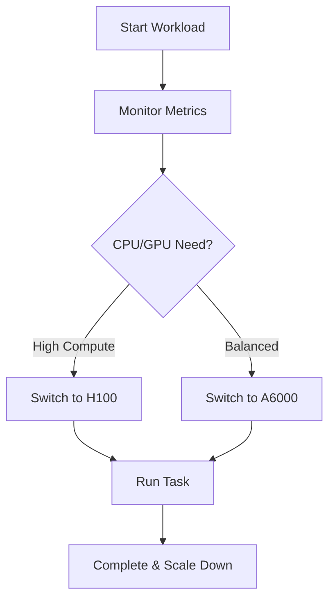

## Overview

GPUiq provides powerful GPU rentals optimized for AI training, machine learning inference, 3D rendering, and cryptocurrency mining. You access high-performance hardware at affordable prices, with up to 70% cost savings compared to traditional cloud providers. Key features include diverse GPU types, automatic switching for resource optimization, snapshot functionality for data preservation, and flexible pricing models.

<Callout kind="info">
  Start by selecting a GPU type that matches your workload. GPUiq automatically scales resources to minimize costs and downtime.
</Callout>

## Available GPU Types

GPUiq offers a range of GPUs with detailed performance specifications. Choose based on your needs for VRAM, compute power, and tensor performance.

| GPU Model | VRAM | FP32 TFLOPS | Tensor Cores | Ideal For |
|-----------|------|-------------|--------------|-----------|
| NVIDIA A100 | 80GB | 19.5 | 432 | AI training, large models |
| NVIDIA H100 | 141GB | 67 | 528 | High-end ML, HPC |
| RTX 4090 | 24GB | 82.6 | 304 | Rendering, gaming sims |
| A6000 | 48GB | 38.7 | 336 | Balanced ML/rendering |

<Columns cols={2}>
  <Card title="High VRAM Options" icon="database" href="#available-gpu-types">
    Select A100 or H100 for memory-intensive tasks like training LLMs.
  </Card>
  <Card title="Cost-Effective Choices" icon="dollar-sign" href="#available-gpu-types">
    Use RTX 4090 for rendering workloads with excellent price/performance.
  </Card>
</Columns>

## Automatic Switching

Automatic switching dynamically allocates the optimal GPU based on your workload demands. GPUiq monitors usage and switches seamlessly to prevent overprovisioning.



<Steps>
  <Step title="Enable Auto-Switching" icon="settings">
    In your dashboard, toggle `autoSwitch` to `true`.
  </Step>
  <Step title="Define Rules" icon="sliders">
    Set thresholds: `minVRAM: "24GB"`, `maxTFLOPS: 50`.
  </Step>
  <Step title="Monitor Transitions" icon="activity">
    View logs for switch events.
  </Step>
</Steps>

## Snapshot Functionality

Snapshots capture your GPU instance state, including data and models, for quick restoration. Preserve progress without full recreation.

<Tabs>
  <Tab title="Create Snapshot" icon="camera">
````bash
curl -X POST https://api.example.com/v1/snapshots \
  -H "Authorization: Bearer YOUR_TOKEN" \
  -d '{
    "instanceId": "gpu-12345",
    "name": "model-training-v1"
  }'
````
  </Tab>
  <Tab title="Restore Snapshot" icon="refresh-cw">
````bash
curl -X POST https://api.example.com/v1/instances \
  -H "Authorization: Bearer YOUR_TOKEN" \
  -d '{
    "snapshotId": "snap-67890",
    "gpuType": "A100"
  }'
````
  </Tab>
</Tabs>

<Expandable title="Advanced Snapshot Options" default-open="false">
  Use tags for organization: `tags: {["ai-training", "v1.2"]}`. Retain up to 50 snapshots per account.
</Expandable>

## Cost-Saving Mechanisms

GPUiq delivers up to 70% savings through on-demand pricing, reserved instances, and spot markets. Pay only for active usage with automatic shutdowns.

<CodeGroup tabs="CLI,Dashboard">
````bash
# CLI: List pricing
gpuiq pricing list --region us-east
````

```javascript
// JS SDK
const pricing = await gpuiq.pricing.list({ region: 'us-east' });
console.log(pricing.spot.a100); // $0.50/hour
```
</CodeGroup>

| Model | Hourly Rate (A100) | Savings |
|-------|---------------------|---------|
| On-Demand | $1.20 | Baseline |
| Reserved (1yr) | $0.72 | 40% |
| Spot | $0.36 | 70% |

<Callout kind="tip">
  Combine spot instances with snapshots for maximum savings on interruptible workloads.
</Callout>