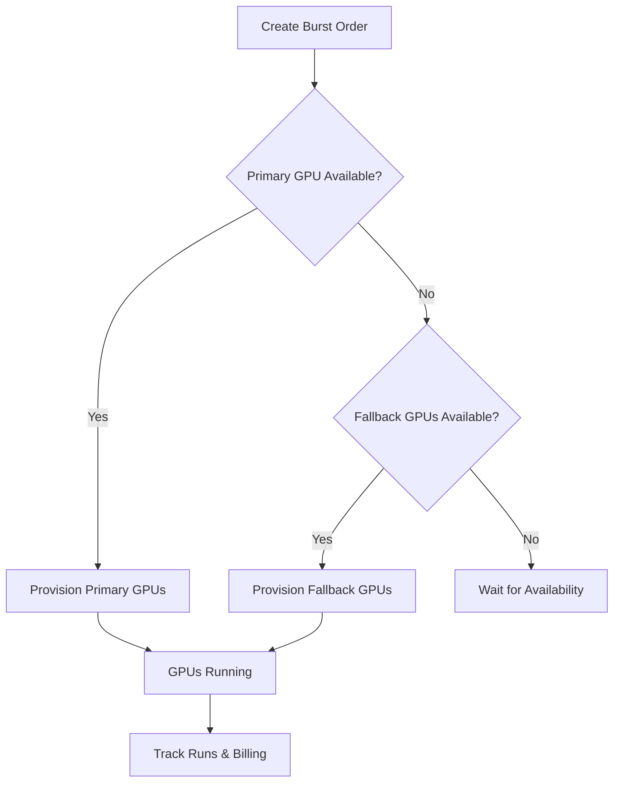

## Overview

GPU Burst provisions multiple GPUs across multiple machines simultaneously. Define your primary GPU type and optional fallback alternatives — if your preferred GPU isn't available, the system automatically uses alternatives within your price caps.

**Best for:** Distributed training, batch inference, large-scale data processing, and any workload that needs to scale fast.

Key features:
- Up to **100 GPUs** in a single order
- **Fallback GPU types** with price caps
- Automatic provisioning across multiple providers
- Per-order billing and run tracking

## How It Works



## Create a Burst Order

<CodeGroup>
```python Python SDK
from gpuniq import GPUniq
client = GPUniq(api_key="gpuniq_your_key")

order = client.burst.create_order(
    docker_image="pytorch/pytorch:latest",
    primary_gpu="RTX_4090",
    gpu_count=8,
    extra_gpus=[
        {"gpu_name": "RTX_3090", "max_price": 0.5},
        {"gpu_name": "A100", "max_price": 1.2},
    ],
    volume_id=9,
    disk_gb=200,
)

print(f"Order ID: {order['order_id']}")
```

```bash cURL
curl -X POST "https://api.gpuniq.com/v1/burst/orders" \
  -H "X-API-Key: gpuniq_your_key" \
  -H "Content-Type: application/json" \
  -d '{
    "docker_image": "pytorch/pytorch:latest",
    "primary_gpu": "RTX_4090",
    "gpu_count": 8,
    "extra_gpus": [
      {"gpu_name": "RTX_3090", "max_price": 0.5},
      {"gpu_name": "A100", "max_price": 1.2}
    ],
    "disk_gb": 200
  }'
```
</CodeGroup>

### Order Parameters

<ParamField body="docker_image" type="string" required>
  Docker image to deploy on all GPUs.
</ParamField>

<ParamField body="primary_gpu" type="string" required>
  Primary GPU type (e.g., `RTX_4090`).
</ParamField>

<ParamField body="gpu_count" type="integer" required>
  Number of GPUs to provision (1-100).
</ParamField>

<ParamField body="extra_gpus" type="object[]">
  Fallback GPU types with price caps. Each item: `{"gpu_name": "...", "max_price": 0.5}`.
</ParamField>

<ParamField body="volume_id" type="integer">
  Persistent volume to attach to all instances.
</ParamField>

<ParamField body="disk_gb" type="integer" default="50">
  Disk size per instance in GB (20-1024).
</ParamField>

## Cost Estimation

Estimate cost before creating an order:

```python
estimate = client.burst.estimate(
    docker_image="pytorch/pytorch:latest",
    primary_gpu="RTX_4090",
    gpu_count=8,
)
```

Check Docker image size before deploying:

```python
size = client.burst.check_image_size("pytorch/pytorch:latest")
```

## Manage Orders

```python
# List all burst orders
orders = client.burst.list_orders(limit=100, offset=0)

# Get order details
details = client.burst.get_order(order_id=1)

# Start / stop / delete
client.burst.start_order(order_id=1)
client.burst.stop_order(order_id=1)
client.burst.delete_order(order_id=1)
```

## Billing & Run History

Track costs and GPU run history per order:

```python
# Billing transactions
txns = client.burst.transactions(order_id=1, limit=50)

# GPU run history
runs = client.burst.runs(order_id=1, limit=50)
```

## Comparison: Burst vs Marketplace vs Dex-Cloud

| | Marketplace | Dex-Cloud | Burst |
|---|---|---|---|
| **GPU count** | 1 server | 1-8 GPUs | 1-100 GPUs |
| **Fallback GPUs** | No | No | Yes |
| **Auto-provisioning** | No | Yes | Yes |
| **Best for** | Long training runs | Quick experiments | Distributed training |
| **Price control** | Pick by server | By GPU type | Max price per fallback |
