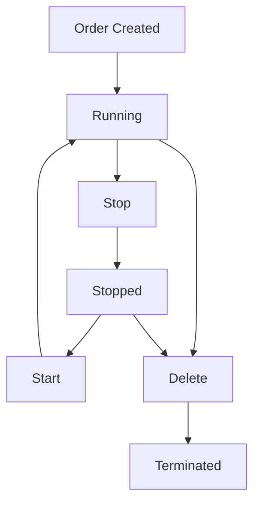

## Creating Rentals

Rent GPU instances through the GPUniq marketplace or API based on your compute needs.

<Steps>
  <Step title="Browse Marketplace" icon="search">
    Navigate to [gpuniq.com](https://gpuniq.com) and browse available GPUs.
  </Step>
  <Step title="Select GPU" icon="zap">
    Click on a GPU card to view full specifications:
    - GPU model and VRAM
    - Total RAM and CPU cores
    - Storage capacity
    - Location and provider reliability
  </Step>
  <Step title="Choose Pricing" icon="dollar-sign">
    Select billing type: per minute, hour, day, week, or month.
  </Step>
  <Step title="Rent" icon="rocket">
    Click "Rent Now" - your instance starts within seconds.
  </Step>
</Steps>

## API-Based Rental

Create rentals programmatically for automation workflows.

<CodeGroup tabs="cURL,JavaScript,Python">
```bash
curl -X POST https://api.gpuniq.com/v1/marketplace/order \
  -H "Authorization: Bearer YOUR_API_KEY" \
  -H "Content-Type: application/json" \
  -d '{
    "agent_id": 123,
    "gpu_required": 1,
    "pricing_type": "hour"
  }'
```
```javascript
const response = await fetch('https://api.gpuniq.com/v1/marketplace/order', {
  method: 'POST',
  headers: { 
    'Authorization': `Bearer ${YOUR_API_KEY}`, 
    'Content-Type': 'application/json' 
  },
  body: JSON.stringify({
    agent_id: 123,
    gpu_required: 1,
    pricing_type: 'hour'
  })
});
const result = await response.json();
console.log(result.data.task_id);
```
```python
import requests
response = requests.post(
  'https://api.gpuniq.com/v1/marketplace/order',
  headers={'Authorization': 'Bearer YOUR_API_KEY', 'Content-Type': 'application/json'},
  json={
    'agent_id': 123,
    'gpu_required': 1,
    'pricing_type': 'hour'
  }
)
result = response.json()
print(result['data']['task_id'])
```
</CodeGroup>

### Async Order Creation

For better reliability, use the async order endpoint which returns a job ID for polling:

```bash
# Create order asynchronously
curl -X POST https://api.gpuniq.com/v1/marketplace/order/async \
  -H "Authorization: Bearer YOUR_API_KEY" \
  -H "Content-Type: application/json" \
  -d '{"agent_id": 123}'

# Poll for status
curl https://api.gpuniq.com/v1/marketplace/order/status/{job_id} \
  -H "Authorization: Bearer YOUR_API_KEY"
```

<Callout kind="tip">
  Use async orders for production systems to handle network timeouts gracefully.
</Callout>

## Viewing Your Instances

Access your active rentals through the dashboard or API.

<Tabs>
  <Tab title="Dashboard" icon="monitor">
    Go to **My Instances** in your dashboard to see:
    - Active rentals with SSH credentials
    - Running time and cost
    - GPU utilization metrics
    - Quick actions (stop, delete)
  </Tab>
  <Tab title="API" icon="code">
    List your instances programmatically:

```bash
curl https://api.gpuniq.com/v1/instances/my \
  -H "Authorization: Bearer YOUR_API_KEY"
```

Response:
```json
{
  "data": {
    "items": [
      {
        "task_id": 456,
        "agent_id": 123,
        "status": "running",
        "ssh_host": "203.0.113.50",
        "ssh_port": 22001,
        "ssh_password": "generated_password",
        "started_at": "2026-01-09T10:30:00Z",
        "hourly_cost": 0.45
      }
    ],
    "total": 1
  }
}
```
  </Tab>
</Tabs>

## Instance Lifecycle

Control your instances efficiently to manage costs.

<Columns cols={3}>
  <Card title="Start" icon="play" href="#start-instance">
    Resume a stopped instance.
  </Card>
  <Card title="Stop" icon="pause" href="#stop-instance">
    Pause billing while preserving state.
  </Card>
  <Card title="Delete" icon="trash-2" href="#delete-instance">
    Permanently terminate the rental.
  </Card>
</Columns>



### Stop Instance

Pause your rental to stop billing. The instance state may or may not be preserved depending on the provider.

<CodeGroup tabs="cURL,Python">
```bash
curl -X POST https://api.gpuniq.com/v1/instances/{task_id}/stop \
  -H "Authorization: Bearer YOUR_API_KEY"
```
```python
requests.post(
  f'https://api.gpuniq.com/v1/instances/{task_id}/stop',
  headers={'Authorization': 'Bearer YOUR_API_KEY'}
)
```
</CodeGroup>

### Start Instance

Resume a stopped instance:

```bash
curl -X POST https://api.gpuniq.com/v1/instances/{task_id}/start \
  -H "Authorization: Bearer YOUR_API_KEY"
```

### Delete Instance

Permanently terminate a rental:

```bash
curl -X DELETE https://api.gpuniq.com/v1/instances/{task_id} \
  -H "Authorization: Bearer YOUR_API_KEY"
```

<Callout kind="warning">
  Deleting an instance is irreversible. All data on the instance will be lost.
</Callout>

## Connecting to Your Instance

After renting, you receive SSH access credentials.

### SSH Connection

```bash
ssh root@{ssh_host} -p {ssh_port}
# Enter the password from your dashboard
```

### Using SSH Keys

For passwordless access, add your public key after first login:

```bash
# On your local machine
cat ~/.ssh/id_rsa.pub | pbcopy

# On the rented GPU
mkdir -p ~/.ssh
echo "YOUR_PUBLIC_KEY" >> ~/.ssh/authorized_keys
chmod 600 ~/.ssh/authorized_keys
```

## Instance Details

Get detailed information about a specific rental:

```bash
curl https://api.gpuniq.com/v1/instances/{task_id} \
  -H "Authorization: Bearer YOUR_API_KEY"
```

Response includes:
- SSH connection details
- Container information
- Start time and duration
- Cost breakdown
- GPU utilization (if available)

## Task History

View your rental history and statistics:

<Tabs>
  <Tab title="Completed Tasks" icon="check-circle">
```bash
curl https://api.gpuniq.com/v1/task-history/completed?days=30 \
  -H "Authorization: Bearer YOUR_API_KEY"
```
  </Tab>
  <Tab title="Statistics" icon="bar-chart">
```bash
curl https://api.gpuniq.com/v1/task-history/user/{user_id}/statistics \
  -H "Authorization: Bearer YOUR_API_KEY"
```
  </Tab>
</Tabs>

## Best Practices

<Expandable title="Cost Optimization Tips" default-open="true">

1. **Use per-minute billing** for short experiments and testing
2. **Commit to longer periods** for production workloads (20-40% savings)
3. **Stop instances** when not in use instead of keeping them running
4. **Monitor utilization** - if GPU usage is low, consider a cheaper option
5. **Use verified providers** for critical workloads to ensure reliability

</Expandable>

<Callout kind="info">
  Your balance is deducted in real-time. Ensure sufficient funds before starting long-running jobs.
</Callout>
