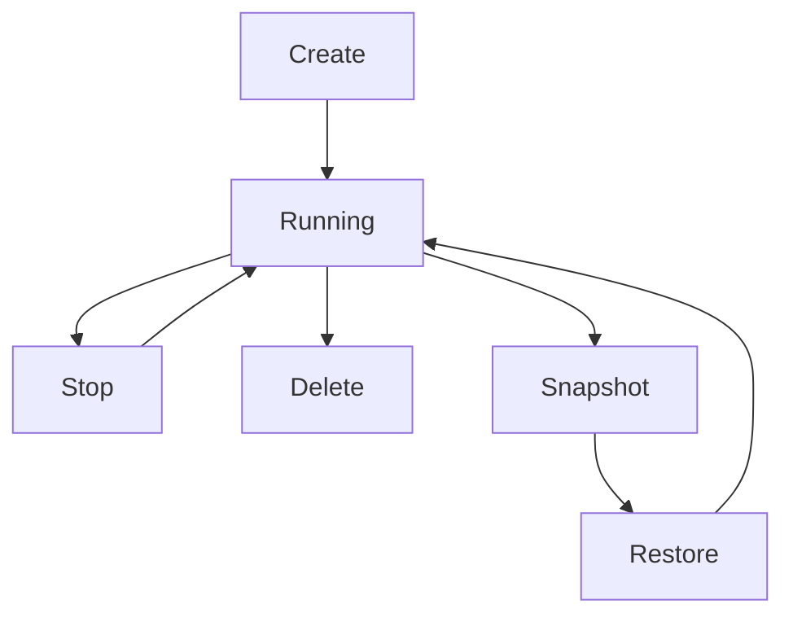

## Creating and Customizing Instances

Create GPU instances through the GPUiq dashboard or API to match your compute needs, such as AI training or 3D rendering. Select GPU types like NVIDIA A100 or H100, configure CPU/RAM, and set storage volumes.

<Steps>
  <Step title="Log in to Dashboard" icon="monitor">
    Navigate to https://dashboard.example.com/instances.
  </Step>
  <Step title="Choose Configuration" icon="settings">
    Select GPU model, vCPU count (e.g., 8-64), RAM (16-512 GB), and storage (100 GB NVMe SSD minimum).
  </Step>
  <Step title="Deploy Instance" icon="rocket">
    Click "Launch" and wait 2-5 minutes for provisioning.
  </Step>
</Steps>

Customize via API for automation:

<CodeGroup tabs="JavaScript,cURL,Python">
  ```javascript
  const response = await fetch('https://api.example.com/v1/instances', {
    method: 'POST',
    headers: { 'Authorization': `Bearer ${YOUR_API_KEY}`, 'Content-Type': 'application/json' },
    body: JSON.stringify({
      name: 'ai-training-node',
      gpu_type: 'A100',
      vcpu: 16,
      memory_gb: 128,
      storage_gb: 500
    })
  });
  const instance = await response.json();
  console.log(instance.id);
  ```
  ```bash
  curl -X POST https://api.example.com/v1/instances \
    -H "Authorization: Bearer YOUR_API_KEY" \
    -H "Content-Type: application/json" \
    -d '{
      "name": "ai-training-node",
      "gpu_type": "A100",
      "vcpu": 16,
      "memory_gb": 128,
      "storage_gb": 500
    }'
  ```
  ```python
  import requests
  response = requests.post(
    'https://api.example.com/v1/instances',
    headers={'Authorization': 'Bearer YOUR_API_KEY', 'Content-Type': 'application/json'},
    json={
      'name': 'ai-training-node',
      'gpu_type': 'A100',
      'vcpu': 16,
      'memory_gb': 128,
      'storage_gb': 500
    }
  )
  instance = response.json()
  print(instance['id'])
  ```
</CodeGroup>

<Callout kind="tip">
  Start with smaller configs to test, then scale up. GPUiq auto-scales storage on demand.
</Callout>

## Monitoring Resource Usage and Performance

Track GPU utilization, memory, and network I/O in real-time to optimize costs and performance.

Use the dashboard for visuals or API for integrations.

<Tabs>
  <Tab title="Dashboard" icon="bar-chart">
    Go to https://dashboard.example.com/instances/{instance_id}/metrics.

    View charts for:
    - GPU utilization (`<80%` ideal for cost savings)
    - VRAM usage
    - Temperature (`<85°C`)

    Set alerts for high usage.
  </Tab>
  <Tab title="API Metrics" icon="api">
    Fetch metrics programmatically:

    <Request tabs="JavaScript,cURL">
      ```javascript
      const metrics = await fetch('https://api.example.com/v1/instances/{instance_id}/metrics', {
        headers: { 'Authorization': `Bearer ${YOUR_API_KEY}` }
      }).then(r => r.json());
      ```
      ```bash
      curl https://api.example.com/v1/instances/{INSTANCE_ID}/metrics \
        -H "Authorization: Bearer YOUR_API_KEY"
      ```
    </Request>

    <Response>
      ```json
      {
        "gpu_util": 75.2,
        "vram_used_gb": 23.5,
        "temperature_c": 72,
        "timestamp": "2024-10-15T12:00:00Z"
      }
      ```
    </Response>
  </Tab>
</Tabs>

## Instance Lifecycle Management

Control your instances efficiently to minimize costs.

<Columns cols={3}>
  <Card title="Stop" icon="pause" href="#stop-instance">
    Pause billing while preserving data. Resume instantly.
  </Card>
  <Card title="Resume" icon="play" href="#resume-instance">
    Restart from stopped state in `<2` minutes.
  </Card>
  <Card title="Delete" icon="trash-2" href="#delete-instance">
    Permanently remove. Use snapshots first for backups.
  </Card>
</Columns>



### Stop and Resume

<ParamField path="instance_id" param-type="string" required="true">
  Instance identifier from creation response.
</ParamField>

Stop via API:

<CodeGroup tabs="cURL,Python">
  ```bash
  curl -X POST https://api.example.com/v1/instances/{INSTANCE_ID}/stop \
    -H "Authorization: Bearer YOUR_API_KEY"
  ```
  ```python
  requests.post('https://api.example.com/v1/instances/{INSTANCE_ID}/stop',
                headers={'Authorization': 'Bearer YOUR_API_KEY'})
  ```
</CodeGroup>

Resume similarly with `/resume`.

### Delete

Confirm deletion to avoid data loss.

## Using Snapshots for Backups and Restores

Snapshots capture instance state for backups, migrations, or quick restores. Create before stopping or scaling.

<Expandable title="Advanced Snapshot Workflow" default-open="false">

1. Create snapshot:

   ```bash
   curl -X POST https://api.example.com/v1/instances/{INSTANCE_ID}/snapshots \
     -H "Authorization: Bearer YOUR_API_KEY" \
     -d '{"name": "pre-training-backup"}'
   ```

2. List snapshots:

   <Response>
     ```json
     [
       {"id": "snap-123", "name": "pre-training-backup", "created": "2024-10-15T10:00:00Z"}
     ]
     ```
   </Response>

3. Restore to new instance using snapshot ID.

</Expandable>

<Callout kind="info">
  Snapshots incur minimal storage costs and enable up to 70% savings by reusing configs.
</Callout>