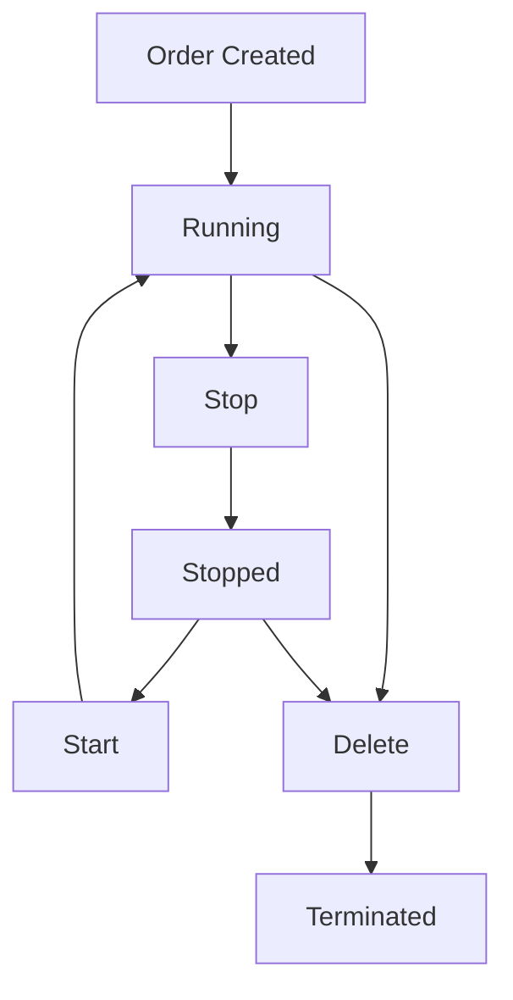

## Overview

All GPU deployment modes (Marketplace, Dex-Cloud, Burst) create instances. Once created, manage them through a unified interface.

## List Instances

<CodeGroup>
```python Python SDK
from gpuniq import GPUniq
client = GPUniq(api_key="gpuniq_your_key")

# Active instances
instances = client.instances.list(page=1, page_size=20)
for inst in instances["instances"]:
    print(f"Task {inst['task_id']}: {inst['status']} — {inst['gpu_model']}")

# Archived (deleted) instances
archived = client.instances.list_archived()
```

```bash cURL
curl "https://api.gpuniq.com/v1/instances/my?page=1&page_size=20" \
  -H "X-API-Key: gpuniq_your_key"
```
</CodeGroup>

## Instance Details

Get full information about a specific instance:

```python
details = client.instances.get(task_id=456)
```

Returns SSH connection details, hardware specs, billing info, and status.

## Instance Lifecycle


```mermaid
graph TD
    A[Order Created] --> B[Running]
    B --> C[Stop]
    C --> D[Stopped]
    D --> E[Start]
    E --> B
    B --> F[Delete]
    D --> F
    F --> G[Terminated]
```

### Start

Resume a stopped instance:

<CodeGroup>
```python Python SDK
client.instances.start(task_id=456)
```

```bash cURL
curl -X POST "https://api.gpuniq.com/v1/instances/456/start" \
  -H "X-API-Key: gpuniq_your_key"
```
</CodeGroup>

### Stop

Pause billing while preserving instance state:

```python
client.instances.stop(task_id=456)
```

### Delete

Permanently terminate the rental:

```python
client.instances.delete(task_id=456)
```

<Callout kind="warning">
  Deleting an instance is irreversible. All data on the instance will be lost. Use [Volumes](/volumes) for persistent data.
</Callout>

### Rename

```python
client.instances.rename(task_id=456, name="bert-finetuning-v2")
```

## Connecting via SSH

After creating an instance, SSH credentials are available in the dashboard:

```bash
ssh root@<host> -p <port>
# Password shown in dashboard
```

### SSH Key Authentication

For passwordless access, add SSH keys before creating the instance:

```python
# Add key in settings
key = client.settings.create_ssh_key(
    key_name="my-laptop",
    public_key="ssh-ed25519 AAAA... user@laptop",
)

# Pass when creating the order
order = client.marketplace.create_order(
    agent_id=123,
    pricing_type="hour",
    ssh_key_ids=[key["id"]],
)
```

### Manage Instance SSH Keys

```python
# List keys attached to instance
keys = client.instances.ssh_keys(task_id=456)

# Attach / detach
client.instances.attach_ssh_key(task_id=456, ssh_key_id=1)
client.instances.detach_ssh_key(task_id=456, key_id=1)
```

## Container Logs

View Docker container logs for your instance:

```python
logs = client.instances.logs(task_id=456)
```

## SLA Monitoring

Check uptime and availability data:

```python
sla = client.instances.sla(task_id=456)
```

Returns 24-hour and 7-day uptime segments and percentages.

## Pending Jobs

Track deployment jobs that haven't completed yet:

```python
jobs = client.instances.list_pending_jobs()

# Cancel a pending job
client.instances.cancel_pending_job(job_id="abc-123")
```

## Best Practices

<Expandable title="Cost Optimization Tips" default-open="true">

1. **Stop instances** when not in use — billing pauses immediately
2. **Use longer pricing types** for production workloads (20-40% savings)
3. **Attach volumes** for persistent data instead of relying on instance storage
4. **Monitor SLA** for critical workloads to track uptime
5. **Use verified providers** for maximum reliability

</Expandable>
